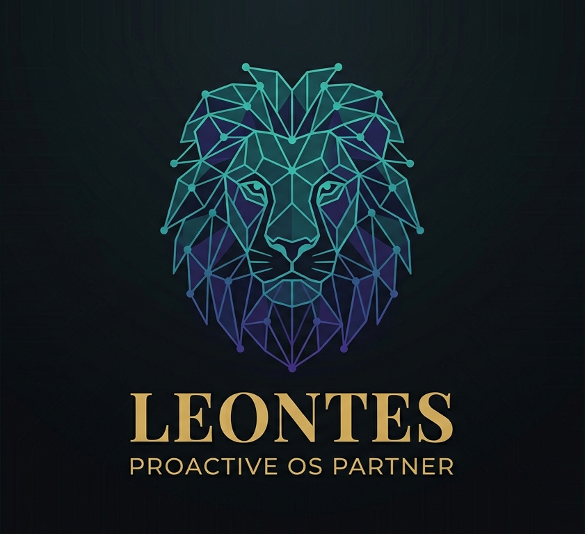

# Leontes

<p align="center">
  
</p>

**A self-hosted AI agent that thinks in stages, acts before you ask, and writes its own tools.**

[leontes.dev](https://leontes.dev)

Leontes is a proactive AI agent for Windows with a neuroscience-inspired cognitive architecture. It doesn't just respond to what you type. It monitors your system, remembers what matters, and extends its own capabilities at runtime.

Talk to it from your terminal. Message it from your phone via Signal or Telegram. Or don't talk to it at all. It'll notice when you need help.

## How it thinks

Most AI agents are a `while(true)` loop around a chat API. Leontes runs a 5-stage cognitive pipeline modeled on Global Workspace Theory and Kahneman's dual-process model:

```
Perceive ──► Enrich ──► Plan ──► Execute ──► Reflect
   │            │          │         │           │
entities    memories    strategy   response    learning
 + intent   + graph     + tools    + streaming  + graph updates
```

Each stage is an independent executor. The pipeline checkpoints after every stage. If the server crashes, it resumes from where it left off. The agent can pause mid-pipeline to ask you a question and continue when you answer.

### System 1 + System 2

Not everything goes through the full pipeline. Leontes uses a dual-process architecture:

- **System 1 (Sentinel):** Fast, local, free. Watches your file downloads, clipboard, calendar, and active windows. Applies heuristic filters (regex, frequency analysis, time rules). No LLM calls. Handles most OS events by reflex.
- **System 2 (Thinking Pipeline):** Slow, deliberate, powerful. The full 5-stage pipeline with LLM reasoning. Only activated when System 1 detects something it can't handle alone.

The result: your agent notices when you copy an IBAN and asks if you want to find the matching invoice. No tokens burned on every clipboard change.

## What makes this different

| Capability | How |
|---|---|
| **Cognitive Pipeline** | 5-stage thinking process (Perceive → Enrich → Plan → Execute → Reflect) with checkpoint recovery and mid-task human interaction |
| **Hierarchical Memory** | 4 memory types: Working (context), Episodic (past events via pgvector), Semantic (knowledge graph), Procedural (learned skills) |
| **Proactive Intelligence** | Dual-process Sentinel: local heuristics filter OS events, only surprising ones reach the LLM |
| **Structural Vision** | Reads application UI via Windows UI Automation. Sees buttons and text as code, not pixels |
| **Self-Extending** | Writes, compiles, tests, and registers new tools at runtime via Roslyn. You approve before anything runs |
| **Confidence Scoring** | Signals how certain it is (0–1). Asks for clarification when uncertain, proceeds confidently when sure |
| **Show Your Work** | Every decision is traced. Ask "Why did you do that?" and get a real answer from stored pipeline traces |
| **Cost Aware** | Token budgets per feature, two model tiers (Large for reasoning, Small for summarization), budget-driven downgrading, throttling before you hit limits |
| **Privacy First** | All monitoring is opt-in. Review, export, or delete any stored data. "Forget Project X" cascades across all tables |
| **Multi-Channel** | CLI + Signal (E2E encrypted) + Telegram. Same brain, same memory, any device |
| **Agent Persona** | Configurable personality, tone, and boundaries in `persona.md`. Two model tiers (Large for reasoning, Small for summarization). Per-stage temperature. Budget-driven tier downgrading |
| **Protocol Standards** | AG-UI (web frontends), MCP (external tool servers), A2A (agent-to-agent). All via Microsoft Agent Framework |

## Architecture

Three executable projects sharing one cognitive engine and one knowledge graph:

| Component | Project | Responsibility |
|-----------|---------|----------------|
| **Backend API** | `Leontes.Api` | Thinking Pipeline, HTTP endpoints, SSE streaming, auto-migration, rate limiting |
| **Worker** | `Leontes.Worker` | Windows Service: Sentinel (OS monitoring) + Signal/Telegram bridges |
| **CLI** | `Leontes.Cli` | dotnet tool (`leontes`): chat, setup wizard, privacy controls, budget dashboard |

```
                         ┌─────────────────────────┐
                         │     Thinking Pipeline    │
                         │  Perceive → Enrich →     │
  CLI ──────────────►    │  Plan → Execute → Reflect│    ──► Response
  Signal ───────────►    │         ▲         │      │
  Telegram ─────────►    │    Memory +    Tools +   │
  Sentinel ─────────►    │    Graph      Forge      │
                         └─────────────────────────┘

  Sentinel (System 1)                  Memory (4 types)
  FS / Clipboard / Calendar / Window   Working / Episodic / Semantic / Procedural
  → Heuristic Filter → Rate Limit     → pgvector + Recursive CTEs
  → Escalate only surprises            → Graph-Augmented Retrieval
```

**Stack:** .NET 10, PostgreSQL 17 + pgvector, Microsoft.Agents.AI + Workflows, Windows UI Automation, Roslyn.

**Inspired by:** Global Workspace Theory (Dehaene), Dual-Process Theory (Kahneman), Generative Agents (Park et al.), Voyager (Wang et al.), Free Energy Principle (Friston).

## Development

### Prerequisites

| Tool | Version | Purpose |
|------|---------|---------|
| [.NET SDK](https://dot.net/download) | 10+ | Build and run the backend |
| [Docker](https://docs.docker.com/get-docker/) | Latest | Run PostgreSQL locally |
| [Ollama](https://ollama.com/) | Latest | Local LLM inference |

### First-time setup

```bash
# 1. Pull the AI model used for local development
ollama pull qwen2.5:7b

# 2. Create a .env file for Docker Compose (copy the example and adjust if needed)
cp .env.example .env

# 3. Set the database connection string for the API and Worker
dotnet user-secrets set "ConnectionStrings:DefaultConnection" \
  "Host=localhost;Port=5432;Database=leontes;Username=leontes;Password=leontes" \
  --project backend/src/Leontes.Api

dotnet user-secrets set "ConnectionStrings:DefaultConnection" \
  "Host=localhost;Port=5432;Database=leontes;Username=leontes;Password=leontes" \
  --project backend/src/Leontes.Worker

# 4. Install the CLI as a dotnet tool
dotnet pack backend/src/Leontes.Cli/ --configuration Release -o ./nupkg
dotnet tool install --global --add-source ./nupkg Leontes.Cli

# 5. Generate and configure the API key (sets User Secrets for API, Worker, and CLI)
leontes init
```

> **Reinstalling the CLI after code changes:** Uninstall first, then pack and install again:
> ```bash
> dotnet tool uninstall --global Leontes.Cli
> dotnet pack backend/src/Leontes.Cli/ --configuration Release -o ./nupkg
> dotnet tool install --global --add-source ./nupkg Leontes.Cli
> ```

> **EF Core migrations:** The design-time factory reads `LEONTES_CONNECTION_STRING` from the environment. Set it before running `dotnet ef migrations add`:
>
> ```bash
> # PowerShell
> $env:LEONTES_CONNECTION_STRING="Host=localhost;Port=5432;Database=leontes;Username=leontes;Password=leontes"
>
> # Bash
> export LEONTES_CONNECTION_STRING="Host=localhost;Port=5432;Database=leontes;Username=leontes;Password=leontes"
> ```

### Running locally

```bash
# Terminal 1: PostgreSQL
docker compose up -d db

# Terminal 2: API (auto-migrates the database on first run)
dotnet run --project backend/src/Leontes.Api --configuration Release

# Terminal 3: CLI chat
leontes chat
```

Once the CLI starts, type a message and hit Enter. That's it.

The **Worker** (Sentinel + Signal/Telegram bridges) is optional during development. Most of its functionality is still in progress. If you want to run it:

```bash
dotnet run --project backend/src/Leontes.Worker --configuration Release  # Windows only
```

### Signal setup (optional)

Signal lets you message Leontes from your phone via E2E encrypted messaging. It uses [signal-cli-rest-api](https://github.com/bbernhard/signal-cli-rest-api) running in Docker. No Java needed on your machine. Signal is entirely optional. If you skip it, the Worker still runs Sentinel normally.

**Full guide:** [docs/signal-setup.md](docs/signal-setup.md)

### Telegram setup (optional)

Telegram lets you message Leontes from your phone via the official [Telegram Bot API](https://core.telegram.org/bots/api). No SIM card, no Docker container. Just an HTTPS bot token. Telegram is entirely optional. If you skip it, the Worker still runs everything else normally.

**Full guide:** [docs/telegram-setup.md](docs/telegram-setup.md)

> **Note:** All `dotnet run` / `dotnet build` commands use `--configuration Release` because Windows Application Control (WDAC) blocks unsigned Debug-built DLLs. The CLI is installed as a global dotnet tool (see First-time setup) and is not affected.

> **Note:** Ollama must be running before you start the API. If you installed Ollama normally it runs in the background automatically. If not, start it with `ollama serve`.

### Build and test

```bash
dotnet build backend/ --configuration Release
dotnet test backend/ --configuration Release
```

### Health check

The API exposes a `/_health` endpoint. You can verify everything is connected:

```bash
# Local development (default launch profile)
curl http://localhost:5154/_health

# Docker Compose
curl http://localhost:5000/_health
```

### Secrets

Use [.NET User Secrets](https://learn.microsoft.com/en-us/aspnet/core/security/app-secrets) for local development. Never put secrets in committed files.

### CI

GitHub Actions: restore, build, test on push to `main`, `develop`, `feature/*`. Must pass before merge.

## Feature Roadmap

Ordered by implementation sequence:

| # | Feature | Status |
|---|---|---|
| 10 | CLI Chat | ✅ Implemented |
| 20 | Conversation Memory | ✅ Merged into #80 |
| 30 | PoC / Setup Wizard | ✅ Implemented |
| 40 | API Authentication | ✅ Implemented |
| 50 | Signal Support | ✅ Implemented |
| 60 | Telegram Support | ✅ Implemented |
| 65 | Proactive Communication | 📋 Specified |
| 75 | Agent Persona & Model Configuration | 📋 Specified |
| 70 | Thinking Pipeline | 📋 Specified |
| 85 | Error Recovery & Resilience | 📋 Specified |
| 80 | Hierarchical Memory | 📋 Specified |
| 90 | Sentinel Intelligence | 📋 Specified |
| 95 | Observability & Cognitive Telemetry | 📋 Specified |
| 100 | Cost Control & Budget Management | 📋 Specified |
| 105 | Structural Vision | 📋 Specified |
| 110 | Privacy & Data Governance | 📋 Specified |
| 115 | Tool Forge | 📋 Specified |
| 120 | Industry Protocol Standards (AG-UI, MCP, A2A) | 📋 Specified |

## Status

Early development. Core infrastructure (CLI, auth, Signal, Telegram) is implemented. The cognitive architecture is fully designed across 18 feature specs, 6 implemented and 12 specified.

## License

AGPL-3.0. Free for personal use. Commercial use requires a [commercial license](mailto:leontes.dev@pm.me).
